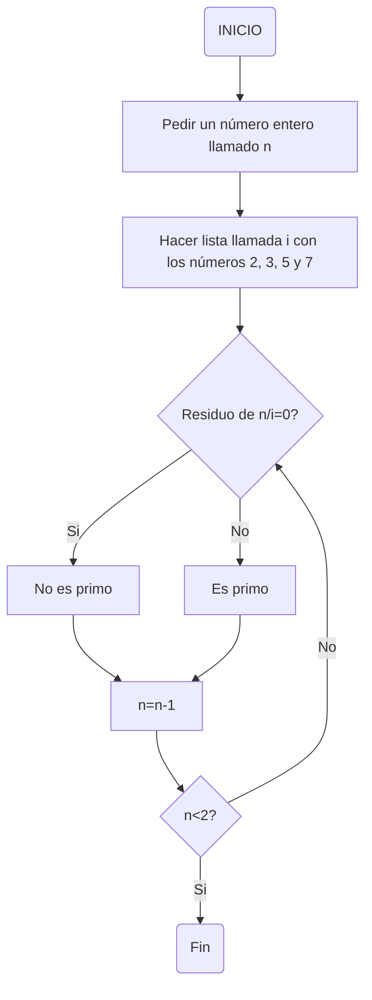
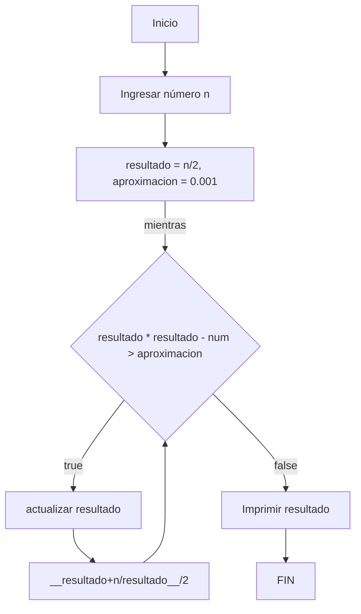

# Reto3
## Pseudocodigo de números primos 
```pseudocode
INICIO
    n : entero # n será un número entero
    i : [2, 3, 5, 7] # hacer una lista llamada i con los números 2, 3, 5 y 7
    Mientras n >= 2 hacer # comenzar una iteración mientras n sea mayor o igual a 2
        Si modulo(n,i) == 0 entonces # si el residuo de la división de n sobre i es 0
            escribir("n no es primo") # el número no es primo ya que tiene más de dos divisores
        Si no 
            n es primo # sería primo ya que solo tendría de divisor al número 1 y a el mismo
        n = n - 1 # este mismo procedimiento desde n hasta que el número no sea mayor o igual a 2
    fin mientras
FIN
```
## Diagrama de flujo



## Pseudocogido raices

```pseudocode
INICIO
    n : entero # n será un número entero
    aproximacion = 0.001 # Tenemos esta aproximación, es decir que el resultado se debe acercar a la aproximacion
    resultado = n/2
    Mientras (resultado ^ 2 - n) > aproximacion, entonces
        resultado = (resultado + n / resultado) / 2 # actualizar resultado
    fin mientras
    escribir "La raiz cuadrada de n es resultado aproximadamente"
FIN
```

## Diagrama de flujo


